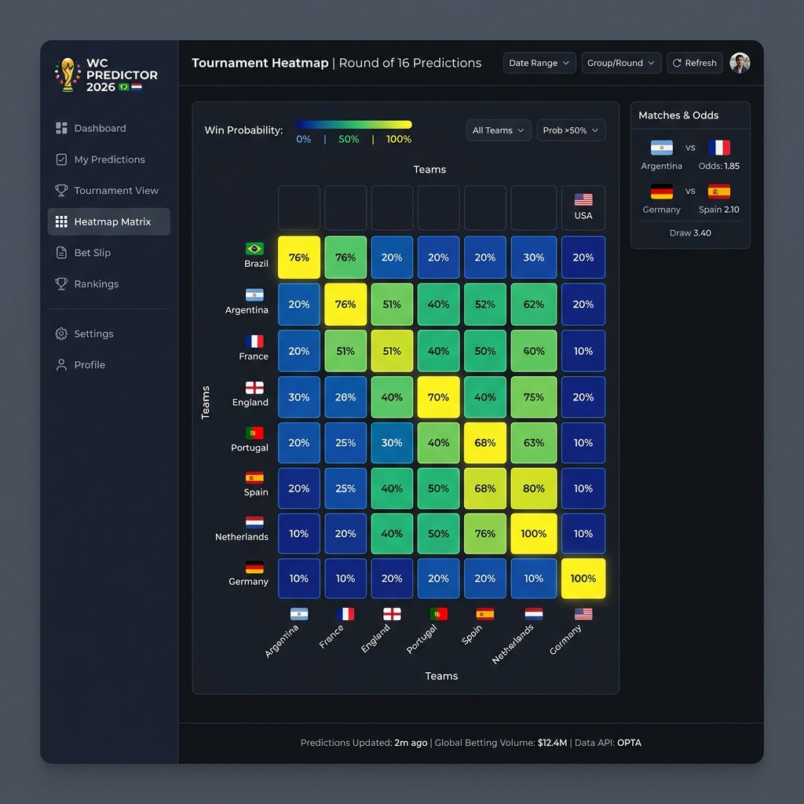

# 🏆 WM 2026 Edge Predictor

Ein quantitatives Wettmodell für die WM 2026. Dieses Dashboard analysiert aktuelle Buchmacher-Quoten und kombiniert sie mit historischen Elo-Ratings, um Value-Bets (die "Edge") und exakte Ergebniswahrscheinlichkeiten in Echtzeit zu berechnen.

## 🧠 Die Mathematik

Unser Edge basiert auf einem mehrstufigen quantitativen Modell. Zuerst rechnet die Engine die Marge der Buchmacher aus den Rohquoten heraus und leitet daraus über einen SciPy-Solver die erwarteten Tore (xG) der Teams ab. Diese xG-Werte werden in zwei unabhängige Poisson-Verteilungen eingespeist, um eine exakte Matrix aller möglichen Spielausgänge zu generieren. Durch den Abgleich mit internationalen Elo-Ratings decken wir schließlich Fehlbepreisungen im Markt auf und extrahieren die mathematisch profitabelsten Tipps (Expected Points).

## 💻 Tech-Stack

- **Python**: Kernsprache für die gesamte Logik
- **Pandas**: Datenmanipulation und Matrix-Transformationen
- **SciPy**: Komplexe Solver-Optimierungen und Poisson-Wahrscheinlichkeiten
- **Streamlit**: Hochdynamisches, reaktives Web-Frontend

## 📸 Dashboard Preview



## 🚀 Setup-Guide

So startest du das Projekt lokal auf deinem Rechner:

1. **Abhängigkeiten installieren:**
   Erstelle am besten eine virtuelle Umgebung und installiere die Requirements.
   ```bash
   python3 -m venv .venv
   source .venv/bin/activate
   pip install -r requirements.txt
   ```

2. **API-Key hinterlegen:**
   Erstelle eine Datei namens `.env` im Hauptverzeichnis und füge deinen Key von *The Odds API* ein:
   ```env
   ODDS_API_KEY=dein_api_key_hier
   ```

3. **Dashboard starten:**
   Führe das Streamlit-Frontend aus:
   ```bash
   streamlit run src/dashboard.py
   ```